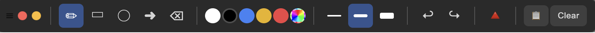
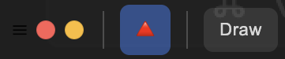
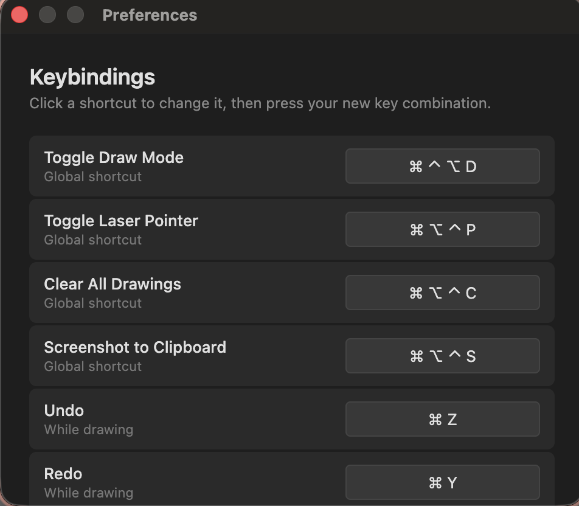

# Screen Paint0r

**Draw on your screen. Point at things with a laser. Screenshots with annotations. All without switching apps.**

Screen Paint0r is a transparent overlay that sits on top of everything. Activate it with a global shortcut, draw freehand lines, shapes, and arrows directly on your screen — then deactivate and everything underneath is still clickable. Your drawings stay visible until you clear them.



## What can it do?

**Draw on your screen** — freehand pen, rectangles, circles, arrows, all in different colors and line widths. Hold Shift for perfect squares and circles. Undo and redo as much as you want.

**Laser pointer mode** — a red dot with a fading trail follows your mouse. Great for presentations, screen shares, or showing someone where to look.



**Screenshot to clipboard** — capture the entire screen with all your drawings composited on top. Paste it anywhere.

**Everything is configurable** — all shortcuts can be changed in Preferences (`Cmd+,`).



## Install

### Homebrew (macOS)

```bash
brew tap lauer-safenow/tap
brew install --cask screen-paint0r
```

Upgrade to the latest version:

```bash
brew upgrade --cask screen-paint0r
```

### Arch Linux

```bash
makepkg -si
```

### From source

```bash
npm install
npm start
```

## Default Shortcuts

All shortcuts are configurable via Preferences (`Cmd+,` / `Ctrl+,`).

| Action | macOS | Linux |
|---|---|---|
| Toggle draw mode | `Cmd+Option+Ctrl+D` | `Ctrl+Alt+Shift+D` |
| Toggle laser pointer | `Cmd+Option+Ctrl+P` | `Ctrl+Alt+Shift+P` |
| Clear all drawings | `Cmd+Option+Ctrl+C` | `Ctrl+Alt+Shift+C` |
| Screenshot to clipboard | `Cmd+Option+Ctrl+S` | `Ctrl+Alt+Shift+S` |
| Undo | `Cmd+Z` | `Ctrl+Z` |
| Redo | `Cmd+Y` | `Ctrl+Y` |
| Minimize menu | `Cmd+M` | `Ctrl+M` |
| Exit current mode | `Escape` | `Escape` |

## Tools

| Tool | Description |
|------|-------------|
| Freehand pen | Draw smooth bezier curves |
| Rectangle | Hold Shift for square |
| Circle / Ellipse | Hold Shift for perfect circle |
| Arrow | Line with arrowhead |
| Eraser | Click a stroke to remove it |

## Colors

White (default), black, blue, yellow, red — plus a custom color picker for any color you want.

## Build commands

| Command | What it does |
|---|---|
| `npm start` | Dev mode — build + run |
| `npm run build` | Build only |
| `npm run pack` | Package macOS `.app` bundle (arm64) |
| `npm run pack:linux` | Package Linux x64 binary |
| `npm run dmg` | Build `.dmg` for distribution |
| `npm run pack:all` | Package both platforms |

## How it works

A transparent, always-on-top overlay window spans all monitors. When draw mode is active, the overlay captures mouse input so you can draw on a canvas layer. When deactivated, clicks pass through to whatever is underneath — your drawings stay visible.

Uses a dual-canvas architecture: a persistent layer for completed strokes and an active layer for live previews, both scaled for HiDPI/Retina displays.

## Tech Stack

- **Electron** — overlay window, global shortcuts, tray
- **TypeScript** — all source code
- **HTML5 Canvas** — drawing engine
- **esbuild** — fast builds

## License

MIT

## Author

By Andi Lauer — lauer AT safenow DOT de
https://github.com/lauer-safenow/screen-paint0r
